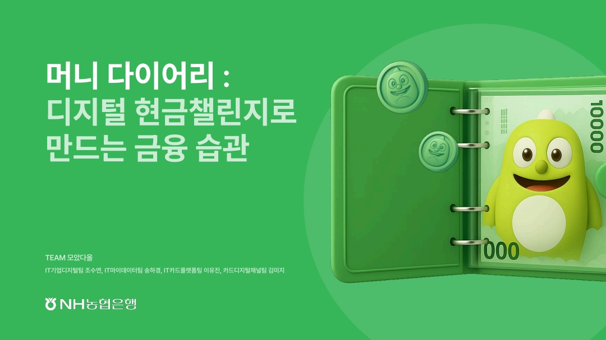

# 📒 MADA (모았다올)

## 서비스 소개
<body>
  <a href="https://www.youtube.com/watch?v=oZaDhSLg-yA " target="_blank">
    

  </a>
</body>

모았다올(머니다이어리) 서비스는 게임, 챌린지, 보상으로 시작해 금융상품으로 연결되는 MZ 맞춤형 금융 서비스 모바일 App 프로젝트 입니다.

 

## 주요 기능 소개
### 서비스 시작하기

- 온보딩 화면을 통해 신규 가입 고객이 서비스를 쉽게 이용할 수 있도록 가이드 안내
- 마이데이터 서비스를 연동하여 기본적으로 소비 습관을 분석하여 자산 자동 설정
- 캘린더 일정 이미지 업로드하면 일정 기반으로 AI가 자동으로 주간 에산 추천
 

### 챌린지

- 챌린지 서비스에 출석체크 및 저축 보상 아이템과 같은 Gamification 요소를 추가
- 공유하기 화면을 통해 본인의 챌린지 상태를 확인하고 다른 사람에게 공유 가능
 

### 예산 설정 및 저축

- 다양한 바인더 테마 제공
- 바인더 화면 및 저축 화면을 직관적인 UI를 통해 진행 상태 확인
 

### 보상

 

## 📒 License

This software is licensed under the NHBank <a href="https://www.nhbank.com/" _blank="new">IT_NHBank</a>

